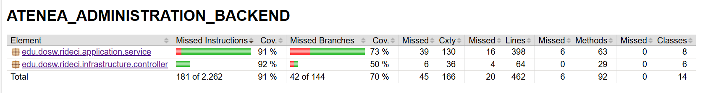
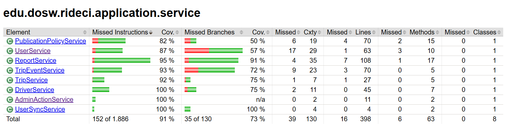
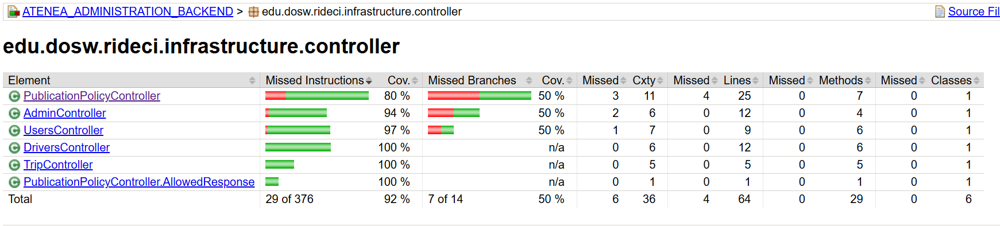
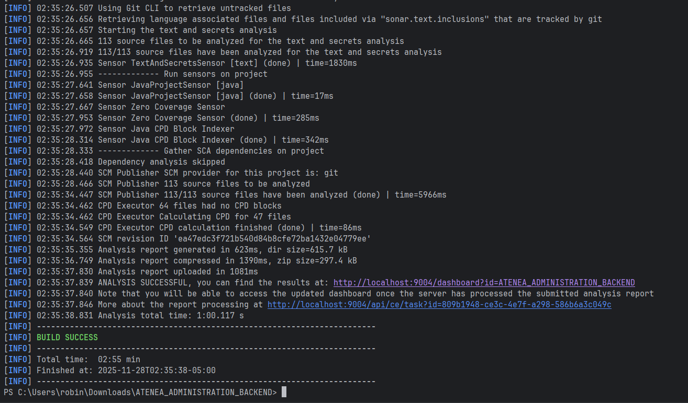
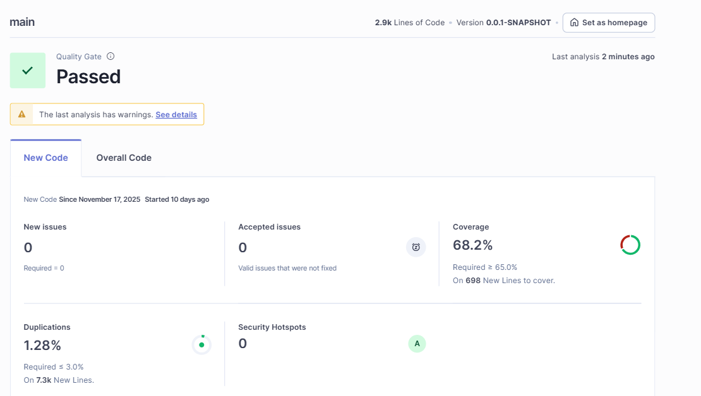
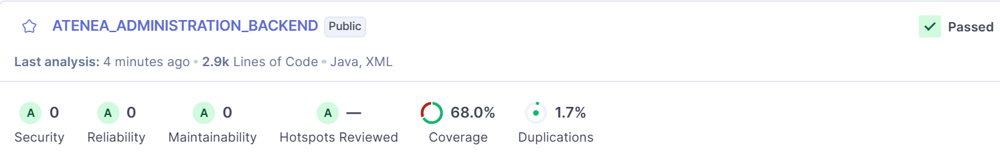
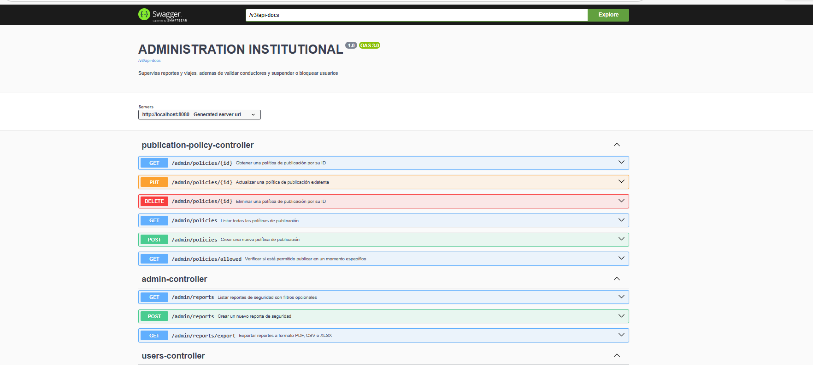

# 👨‍💼  ATENEA_ADMINISTRATION_BACKEND

Centralizes the system’s management and control tools, allowing the institutional mobility or security area to supervise operations, validate users, and generate reports.

## 👥 Developers
* Raquel Iveth Selma Alaya
* Nestor David Lopez Castañeda
* Juan Pablo Nieto Cortes
* Carlos David Astudillo Castiblanco
* Robinson Steven Nuñez Portela


## 🏛️ Project Architecture

The Nemesis - Geolocation, Routes and Tracking have a unacoplated hexagonal - clean architecture where looks for isolate the business logic with the other part of the app dividing it in multiple components:

* **🧠 Domain (Core)**: Contains the business logic and principal rules.

* **🎯 Ports (Interfaces)**: Are interfaces that define the actions that the domain can do.

* **🔌 Adapters (Infrastructure)**: Are the implementations of the ports that connect the domain with the specific technologies.

The use of this architecture has the following benefits:

* ✅ **Separation of Concerns:** Distinct boundaries between logic and infrastructure.
* ✅ **Maintainability:** Easier to update or replace specific components.
* ✅ **Scalability:** Components can evolve independently.
* ✅ **Testability:** The domain can be tested in isolation without a database or server.

## 📂 Clean - Hexagonal Structure

```
📂 nemesis_travel_management_backend
 ┣ 📂 src/
 ┃ ┣ 📂 main/
 ┃ ┃ ┣ 📂 java/
 ┃ ┃ ┃ ┗ 📂 edu/dosw/rideci/
 ┃ ┃ ┃   ┣ 📄 AteneaAdministrationBackEndApplication.java
 ┃ ┃ ┃   ┣ 📂 domain/
 ┃ ┃ ┃   ┃ ┗ 📂 model/            # 🧠 Domain models
 ┃ ┃ ┃   ┣ 📂 application/
 ┃ ┃ ┃   ┃ ┣ 📂 ports/
 ┃ ┃ ┃   ┃ ┃ ┣ 📂 input/          # 🎯 Input ports (Exposed use cases)
 ┃ ┃ ┃   ┃ ┃ ┗ 📂 output/         # 🔌 Output ports (external gateways)
 ┃ ┃ ┃   ┃ ┗ 📂 usecases/         # ⚙️ Use case implementations
 ┃ ┃ ┃   ┣ 📂 infrastructure/
 ┃ ┃ ┃   ┃ ┗ 📂 adapters/
 ┃ ┃ ┃   ┃   ┣ 📂 input/
 ┃ ┃ ┃   ┃   ┃ ┗ 📂 controller/   # 🌐 Input adapters (REST controllers)
 ┃ ┃ ┃   ┃   ┗ 📂 output/
 ┃ ┃ ┃   ┃     ┗ 📂 persistence/  # 🗄️ Output adapters (persistance)
 ┃ ┃ ┗ 📂 resources/
 ┃ ┃   ┗ 📄 application.properties
 ┣ 📂 test/
 ┃ ┣ 📂 java/
 ┃ ┃ ┗ 📂 edu/dosw/rideci/AteneaAdministrationBackEndApplication/
 ┃ ┃   ┗ 📄 AteneaAdministrationBackEndApplicationTests.java
 ┣ 📂 docs/
 ┃ ┣ diagramaClases.jpg
 ┃ ┣ diagramaDatos.jpg
 ┃ ┗ diagramaDespliegue.png
 ┣ 📄 pom.xml
 ┣ 📄 mvnw / mvnw.cmd
 ┗ 📄 README.md
```

# 📡 API Endpoints

For detailed documentation refer to our Swagger UI (Running locally at http://localhost:8080/swagger-ui.html).

Data input & output

| Method | URI | Description | Request Body / Params |
| :--- | :--- | :--- | :--- |
| `POST` | `/admin/reports` | Crear un nuevo reporte de seguridad | `SecurityReport` (JSON en el cuerpo) |
| `GET` | `/admin/reports` | Listar reportes de seguridad con filtros opcionales | Query Params: `type`, `from`, `to` (opcionales) |
| `GET` | `/admin/reports/export` | Exportar reportes a formato PDF, CSV o XLSX | Query Params: `type` (opcional), `format` (default: "xlsx") |
| `GET` | `/admin/drivers` | Listar conductores | Query Params: `status`, `search`, `page` (default: 0), `size` (default: 20) |
| `PATCH` | `/admin/drivers/{id}/approve` | Aprobar conductor | Path Variable: `id`, Query Param: `adminId` |
| `PATCH` | `/admin/drivers/{id}/reject` | Rechazar conductor | Path Variable: `id`, Request Body: `RejectDto` |
| `GET` | `/admin/drivers/{id}` | Ver detalles del conductor | Path Variable: `id` |
| `PATCH` | `/admin/drivers/{id}/documents-ref` | Agregar referencia de documento | Path Variable: `id`, Request Body: `DocumentRefDto`, Query Param: `uploadedBy` (opcional) |
| `POST` | `/admin/policies` | Crear una nueva política de publicación | Request Body: `PublicationPolicy` (JSON) |
| `PUT` | `/admin/policies/{id}` | Actualizar una política de publicación existente | Path Variable: `id`, Request Body: `PublicationPolicy` (JSON) |
| `GET` | `/admin/policies/{id}` | Obtener una política de publicación por su ID | Path Variable: `id` |
| `GET` | `/admin/policies` | Listar todas las políticas de publicación | - |
| `DELETE` | `/admin/policies/{id}` | Eliminar una política de publicación por su ID | Path Variable: `id` |
| `GET` | `/admin/policies/allowed` | Verificar si está permitido publicar en un momento específico | Query Params: `at`, `time`, `userId`, `role` (opcionales) |
| `GET` | `/admin/trips` | Listar viajes | Query Params: `search`, `status`, `type`, `page` (default: 0), `size` (default: 20) |
| `GET` | `/admin/trips/active` | Obtener viajes activos | - |
| `GET` | `/admin/trips/{id}` | Obtener detalle de un viaje | Path Variable: `id` |
| `GET` | `/admin/trips/metrics` | Obtener métricas del dashboard | - |
| `GET` | `/admin/users` | Listar usuarios, filtros opcionales | Query Params: `search`, `status`, `role`, `page` (default: 0), `size` (default: 20) |
| `GET` | `/admin/users/{id}` | Obtener detalle de un usuario | Path Variable: `id` |
| `PATCH` | `/admin/users/{id}/suspend` | Suspender usuario | Path Variable: `id`, Request Body: `SuspendUserRequestDto` |
| `PATCH` | `/admin/users/{id}/activate` | Activar usuario | Path Variable: `id`, Query Param: `adminId` |
| `PATCH` | `/admin/users/{id}/block` | Bloquear usuario | Path Variable: `id`, Query Param: `adminId`, Request Body: `reason` (opcional) |

### 📟 HTTP Status Codes
Common status codes returned by the API.

| Code | Status | Description |
| :--- | :--- | :--- |
| `200` | **OK** | Request processed successfully. |
| `201` | **Created** | Resource (Route/Tracking) created successfully. |
| `400` | **Bad Request** | Invalid coordinates or missing parameters. |
| `401` | **Unauthorized** | Missing or invalid JWT token. |
| `404` | **Not Found** | Route or Trip ID does not exist. |
| `500` | **Internal Server Error** | Unexpected error (e.g., Google Maps API failure).

# Input and Output Data

Data information per functionability


# 🔗 Connections with other Microservices

This module does not work alone. It interacts with the RideCi Ecosystem via REST APIs and Message Brokers:

1. Travel Management Module: Receives information about the travel.

# Technologies

The following technologies were used to build and deploy this module:

### Backend & Core


### Database


### DevOps & Infrastructure


### CI/CD & Quality Assurance


### Documentation & Testing


### Design


### Comunication & Project Management


---

# 🌿 Branches Strategy & Structure

This module follows a strict branching strategy based on Gitflow to ensure the ordered versioning,code quality and continous integration.


| **Branch**                | **Purpose**                            | **Receive of**           | **Sent to**        | **Notes**                      |
| ----------------------- | ---------------------------------------- | ----------------------- | ------------------ | ------------------------------ |
| `main`                  | 🏁 Stable code for preproduction or Production | `release/*`, `hotfix/*` | 🚀 Production      | 🔐 Protected with PR y successful CI   |
| `develop`               | 🧪 Main developing branch             | `feature/*`             | `release/*`        | 🔄 Base to continous deployment |
| `feature/*`             | ✨ New functions or refactors  to be implemented       | `develop`               | `develop`          | 🧹 Are deleted after merge to develop      |
| `release/*`             | 📦 Release preparation & final polish.      | `develop`               | `main` y `develop` | 🧪  Includes final QA. No new features added here.     |
| `bugfix/*` o `hotfix/*` | 🛠️ Critical fixes for production         | `main`                  | `main` y `develop` | ⚡ Urgent patches. Highest priority             |


# 🏷️ Naming Conventions

## 🌿 Branch Naming

### ✨ Feature Branches
Used for new features or non-critical improvements.

**Format:**
`feature/[shortDescription]`

**Examples:**
- `feature/authenticationModule`
- `feature/securityService`

**Rules:**
* 🧩 **Case:** strictly *camelCase* (lowercase with hyphens).
* ✍️ **Descriptive:** Short and meaningful description.
---

### 📦 Release Branches
Used for preparing a new production release. Follows [Semantic Versioning](https://semver.org/).

**Format:**
`release/v[major].[minor].[patch]`

**Examples:**
- `release/v1.0.0`
- `release/v1.1.0-beta`

---

### 🚑 Hotfix Branches
Used for urgent fixes in the production environment.

**Format:**
`hotfix/[shortDescription]`

**Examples:**
- `hotfix/fixTokenExpiration`
- `hotfix/securityPatch`

---

## 📝 Commit Message Guidelines

We follow the **[Conventional Commits](https://www.conventionalcommits.org/)** specification.

### 🧱 Standard Format

```text
<type>(<scope>): <short description>
```

# 📐 System Architecture & Design

This section provides a visual representation of the module's architecture ilustrating the base diagrams to show the application structure and components flow.


### 🧩 Context Diagram

---
The Institutional Administration Module acts as RIDECI's comprehensive monitoring center,
where administrators manage and control all critical aspects of the platform to
ensure security and efficiency.

Its main functions include:

- Driver and vehicle validation through document reviews

- Security monitoring with report review and incident management

- User control through temporary suspensions for violations

- Operational regulation by defining permitted travel times

- Data analysis through usage statistics and PDF report generation


### 🧩 Specific Components Diagram

---

The Institutional Administration module uses a hexagonal architecture to keep business logic independent of frameworks and technical details. This facilitates agile testing, updates, and deployments.

#### Structure and Flow

The React and TypeScript frontend calls controllers that invoke use cases. The use cases contain the core logic: driver approval, user suspension, and report generation. The use cases only depend on ports, keeping the core isolated.

#### Ports and Adapters

Ports define contracts for persistence, event publishing, and notifications. Adapters implement these contracts by integrating with MongoDB, RabbitMQ, and external authentication and reputation services. This allows for replacing or simulating implementations in testing.

#### Auditing and Events

All administrative actions are audited and propagated as events with correlation identifiers and commands for idempotence and traceability. Asynchronous processing avoids blocking the main operation.

#### Policies and Extensibility

Publishing policies are evaluated using a strategy factory. The strategy pattern allows adding rules such as permitted days, roles, or exceptions without modifying the core and facilitates unit testing for each rule.

#### Example Flow

When a driver is approved, the flow goes from the frontend to the use case, which updates the repository, logs the action in audit mode, and publishes an event. Listeners consume the event for notifications, reputation updates, or report generation without impacting the initial operation.

### Functionality of the Institutional Administrator Module:

#### User Management

- List users and view their details.

- Suspend, activate, or block users.

- Manage driver profiles, approving or rejecting them based on the documents submitted to validate their credentials.

#### Trip Tracking

- Track trips in real time to obtain information and take action if anything suspicious occurs with a user.

#### Posting Policies

- Configure policies to post work schedules on specific days of the week and at specific times, so that drivers work according to that schedule.

#### Reports

- Receive safety reports.

- Export reports to CSV, Excel, or PDF as needed.

#### Metrics and Statistics

- Receive metrics and statistics to assess the environmental and sustainability landscape.

#### Business Restrictions:

- The institutional administrator will configure the schedules, allowing drivers to work only from Monday to Saturday, all day.

- When a user is suspended, they will not be automatically reactivated after a certain period; the administrator must reactivate them manually.

- If a user is suspended, their role will be changed to an active one.


### 🧩 Use Cases Diagram

---

Institutional Administration in RIDECI allows administrators to validate driver and vehicle accounts, view active trips and their participants, configure permitted travel times, export reports in formats such as PDF, review usage statistics and sustainability data, and analyze security and user behavior reports.

This module functions as the system's control center, ensuring compliance with institutional policies and maintaining security through constant monitoring of all operations, while providing comprehensive management and reporting tools for institutional decision-making.


#### 🧩 Class Diagram

---

### Design Patterns:

#### Strategy:

This pattern is used because it allows us to encapsulate RidECI's publishing policy rules
and exchange and combine them without needing to change the client,
in this case, the drivers who have to follow the established schedule.

#### Composite:

This pattern is used in conjunction with the Strategy design pattern because it groups all the policies, allowing them to be evaluated
and facilitating the addition of more composite rules if desired.

#### Factory:

This pattern works in conjunction with Composite and allowed us to avoid centralizing all the logic of
the scheduling policy, as it defines specific criteria based
on a policy, such as validating the driver's role, the hours until which a driver must work, and the days of the week.

#### Command

It's not reflected in the class diagram, but it's used for events since it models an action that we have to consume for it to be executed and serve, for example, with the start and end events of a trip so that the administrator can act according to the situation.

--

### **SOLID Principles:**

#### **Single Responsibility:**

- User: to centralize the logic of user roles and manage their profiles according to their behavior.

- Driver: the driver who wants to validate their account, which the admin must review and determine if their documents qualify them to be a driver.

- Trip Monitor: so the administrator can monitor trips and ensure they don't deviate from their route or detect any unusual movements by the driver.

- Security Report: manages the reports made by users so the administrator can keep any situation under control.

- Export Report: This allows the administrator to export the report as a CSV, PDF, or Excel file if needed, and provide it for investigation or as evidence.

- AdminAction: This stores audit logs, which record the actions an administrator has taken, such as suspending or validating a user or driver.

- Policy and Strategy Publishing: This allows us to manage different policies and easily add them to the application.

#### Open/Closed:

We can extend the publishing policies to include more than one type, so each policy functions independently without centralizing all the logic in a single class.


#### Interface Segregation Principle:

Policy Strategy implementations are interchangeable; no one needs to know the specific implementation.


### 🧩 Database Diagram

---

The database primarily uses referenced documents to maintain consistency, performance, and scalability.

AdminAction is stored embedded because it is frequently accessed alongside the affected resource, and atomicity is required for fast reads.

MongoDB was chosen for its flexible document model, scalability, and good integration with the stack.

It also allows us to manage documents in both embedded and referenced formats and is less restrictive, offering easy integration with repositories and mapping.

MongoDB is used to store institutional data.

#### Referenced Documents:

- Prevents data duplication and maintains consistency when entities are used in multiple contexts.

- Enables pagination and efficient management of large collections such as travel and reports.

- Facilitates independent updates without rewriting large parent documents.

- Adds flexibility for queries and aggregations by using lookups only when needed.


### 🧩 Sequence Diagrams

---

The sequence diagrams are focused on following the clean structure of the project, adhering to the following flow:

- Controller
- Use Case
- Repository Port
- Repository Adapter
- MongoDB Repository

Then, the MongoDB database is used to store the documentation.


📄 [Ver diagrama de secuencia](docs/pdf/diagramaSecuencias.pdf)


### 🧩 Specific Deploy Diagram

---

#### Backend and Deployment

- Developed in Java with Spring Boot.

- Automatically deployed to Railway using a CI/CD pipeline with GitHub Actions.

#### Database

- Uses MongoDB to store data for:

- User validations.

- Audit logs.

- Institutional reports.

### Code Quality

- Integrates JaCoCo to measure test coverage.

- Uses SonarQube for static analysis and vulnerability detection.

#### Main Features

- Trip monitoring.

- Secure access and log validation.

- Generation of institutional reports.


### 🧩 General Component Diagram

---


#### **Frontend:** 
 
Developed in TypeScript and deployed in Vercel.


#### **API Gateway:** 

It centralizes and manages communications between components.


#### **Backend:** 

We manage the institutional administration logic, integrating JaCoco SonarQube to ensure code quality and proper functionality for drivers, trips, and users.

We also use a pipeline to validate that everything works as expected.

We deploy to Railway to build the Docker container, use Swagger and Postman for testing, and Spring Boot to efficiently manage the project through a flexible REST API.


# 🚀 Getting Started

### Requesitos
- Java 17
- Maven 3.X
- Docker + Docker Compose
- Puerto disponiblo 8080

### Clone & open repository

`git clone https://github.com/RIDECI/ATENEA_ADMINISTRATION_BACKEND.git`

`cd ATENEA_ADMINISTRATION_BACKEND`

### Dockerize the project

Dockerize before compile the project avoid configuration issues and ensure environment consistency.

``` bash
docker compose up -d
```

[Ver video demostrativo](https://youtu.be/3EqpeV_jBLM)

### Install dependencies & compile project

Download dependencies and compile the source code.

``` bash
mvn clean install
```

``` bash
mvn clean compile
```

### To run the project
Start the Spring Boot server

``` bash
mvn spring-boot:run
```

--- 

#### Prueba de Ejecución Local:

[Ver video demostrativo](https://youtu.be/waTVMDQHkIA)


---
# 🧪 Testing

Testing is a essential part of the project functionability, this part will show the code coverage and code quality analazing with tools like JaCoCo and SonarQube.

### 📊 Code Coverage (JaCoCo)

---

[Ver video de cobertura y jacoco](https://youtu.be/EU2rkBedgvs)










### 🔍 Static Analysis (SonarQube)

---

[Ver video de cobertura de sonar](https://youtu.be/Gdg_f3UIo0c)








### 💻  Evidence Swagger

---



**RIDECI** - Connecting the community to move safely, economically and sustainably.
