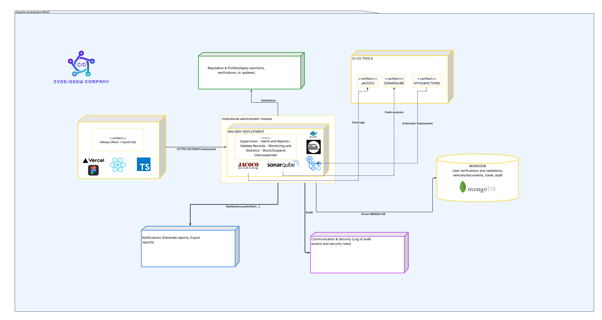
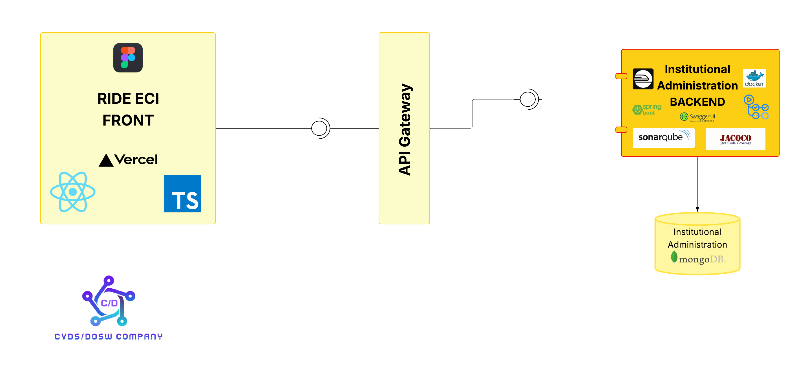
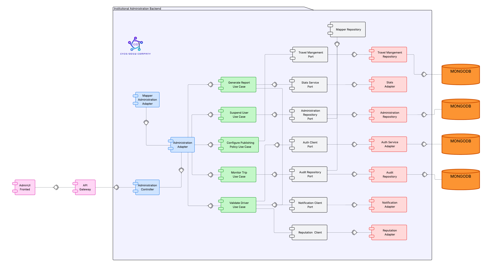
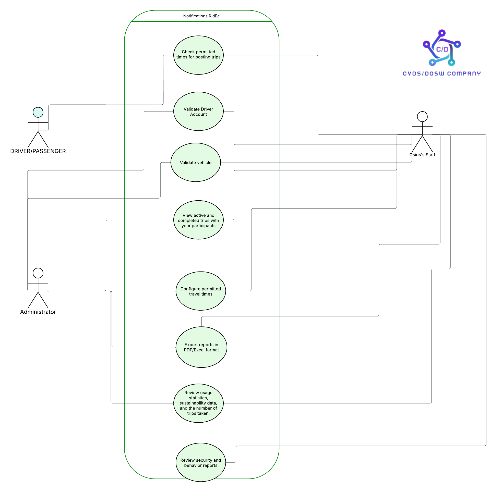
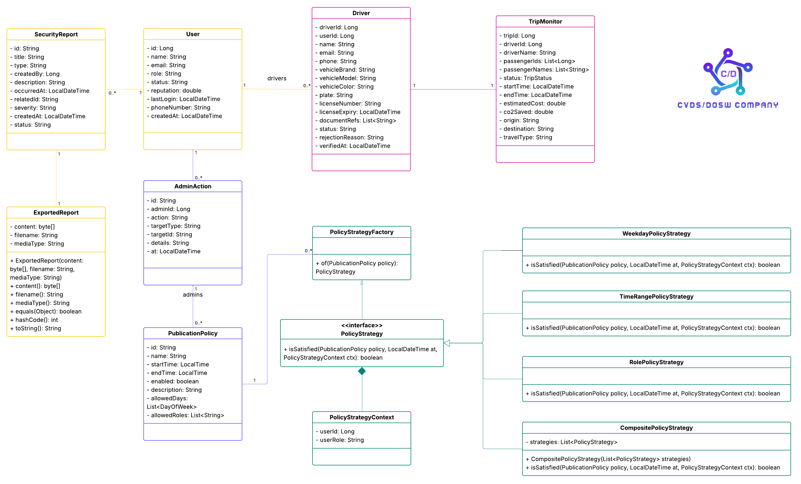
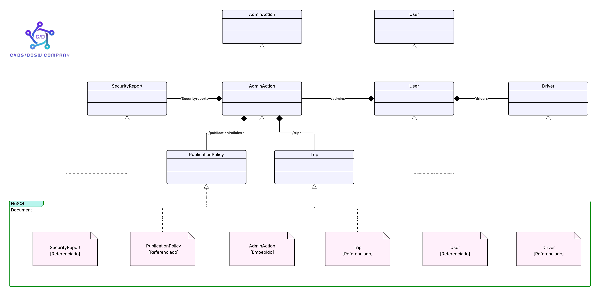
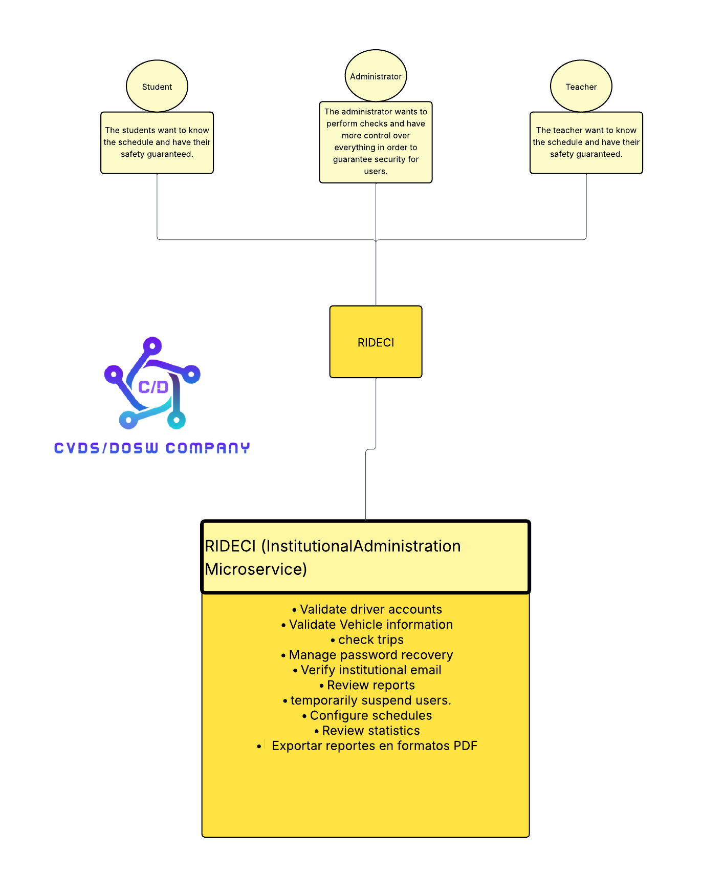

# ATENEA_ADMINISTRATION_BACKEND

## Desarrolladores 

* Raquel Iveth Selma Alaya
* Nestor David Lopez Castañeda
* Juan Pablo Nieto Cortes
* Carlos David Astudillo Castiblanco
* Robinson Steven Nuñez Portela

---

**Descripción:**

Centraliza las herramientas de gestión y control del sistema,
permitiendo al área de movilidad o seguridad institucional supervisar la operación,
validar usuarios y emitir reportes.

---

## Funcionamiento del Módulo de Administrador Institucional:

### Gestión de usuarios

- Listar usuarios y ver sus detalles.

- Suspender, activar o bloquear usuarios.

- Gestionar perfiles de conductores, aprobando o rechazando según los documentos enviados para validar sus papeles.

### Seguimiento de viajes

- Realizar seguimiento a los viajes en tiempo real para obtener información y tomar 
  acciones si ocurre algo sospechoso con un usuario.

### Políticas de publicación

- Configurar políticas para publicar horarios de trabajo los días de la semana y en horas específicas, 
de modo que los conductores trabajen siguiendo ese horario.

### Reportes

- Recibir reportes de seguridad.

- Exportar reportes a CSV, Excel o PDF según sea necesario.


### Métricas y estadísticas

- Recibir métricas y estadísticas para contemplar el panorama ambiental y sostenible.


### Restricciones de negocio:

- El administrador institucional se encargará de configurar los horarios, permitiendo que los conductores solo puedan laborar de lunes a sábado durante todo el día.

- Al suspender un usuario, este no se activará automáticamente después de un tiempo; el administrador debe activarlo manualmente.

- En caso de suspenderlo, se cambiará su rol por uno que esté activo.


---

# Modulo Necesarios:

**Autenticación:**

Para obtener datos de usuarios o roles,  dependemos del servicio de Autenticación ya que tenemos
que listar, aprobar, rechazar,  bloquear, obtener un usuario y etc...


**Manejo de viajes:**

Se requiere para saber cuando empieza o termina un viaje con el fin de obtener sus coordenadas para que con
esa información se pueda actuar rapidamente en caso de un improviso o emergencia. 


**Rutas y tracking:**

Se debe conocer la ruta y seguimiento para que el administrador en caso de que le llegue un reporte pueda 
actuar rapidamente y dar el caso a las autoridades para resolverlo lo más rapido posible.

**Reputación:**

Necesario para identificar el número de estreallas y el desempeño de un usuario para determinar e investigar 
si su compartamiento es el adecuado, con el fin de mantener la armonia.


**Notificaciones:**

El administrador Institucional le deben llegar alertas, reportes y notificaciones, asegurando la integridad de los usuarios
de manera que lleguen segun que tan crítica sea y en casos de ser de alta prioridad y actuar a tiempo.


**Estadisticas:**

Se requieren las estadisticas para generar reportes con gráficos ya sea sobre viajes realizados, 
usuarios aprobados, suspendidos, etc. Con sus respectivass metricas para mostrarlas en tiempo real al administrador.  


---

## Tabla de Contenidos

* [ Estrategia de Versionamiento y Branching](#-estrategia-de-versionamiento-y-branching)

    * [ Estrategia de Ramas (Git Flow)](#-estrategia-de-ramas-git-flow)
    * [ Convenciones de Nomenclatura](#-convenciones-de-nomenclatura)
    * [ Convenciones de Commits](#-convenciones-de-commits)
* [ Arquitectura del Proyecto](#-arquitectura-del-proyecto)

    * [ Estructura de Capas](#️-estructura-de-capas)
* [ Tecnologías Utilizadas](#️-tecnologías-utilizadas)
* [ Arquitectura Limpia - Organización de Capas](#️-arquitectura-limpia---organización-de-capas)
* [Diagramas del Módulo](#diagramas-del-módulo)
* - [Ejecución Local](#ejecución-local)  
* - [Calidad y CI/CD](#calidad-y-cicd)


---

##  Estrategia de Versionamiento y Branching

Se implementa una estrategia de versionamiento basada en **GitFlow**, garantizando un flujo de desarrollo **colaborativo, trazable y controlado**.

###  Beneficios:

- Permite trabajo paralelo sin conflictos
- Mantiene versiones estables y controladas
- Facilita correcciones urgentes (*hotfixes*)
- Proporciona un historial limpio y entendible

---

##  Estrategia de Ramas (Git Flow)

| **Rama**                | **Propósito**                            | **Recibe de**           | **Envía a**        | **Notas**                      |
| ----------------------- | ---------------------------------------- | ----------------------- | ------------------ | ------------------------------ |
| `main`                  | Código estable para PREPROD o Producción | `release/*`, `hotfix/*` | Despliegue         | Protegida con PR y CI exitoso  |
| `develop`               | Rama principal de desarrollo             | `feature/*`             | `release/*`        | Base para integración continua |
| `feature/*`             | Nuevas funcionalidades o refactors       | `develop`               | `develop`          | Se eliminan tras el merge      |
| `release/*`             | Preparación de versiones estables        | `develop`               | `main` y `develop` | Incluye pruebas finales        |
| `bugfix/*` o `hotfix/*` | Corrección de errores críticos           | `main`                  | `main` y `develop` | Parches urgentes               |

---

##  Convenciones de Nomenclatura

### Feature Branches

```
feature/[nombre-funcionalidad]-atenea_[codigo-jira]
```

**Ejemplos:**

```
- feature/authentication-module-atenea_23
- feature/security-service-atenea_41
```

**Reglas:**

*  Formato: *kebab-case*
*  Incluir código Jira
*  Descripción breve y clara
*  Longitud máxima: 50 caracteres

---

### Release Branches

```
release/[version]
```

**Ejemplos:**

```
- release/1.0.0
- release/1.1.0-beta
```

---

### Hotfix Branches

```
hotfix/[descripcion-breve-del-fix]
```

**Ejemplos:**

```
- hotfix/fix-token-expiration
- hotfix/security-patch
```

---

## Convenciones de Commits

### Formato Estándar

```
[codigo-jira] [tipo]: [descripción breve de la acción]
```

**Ejemplos:**

```
45-feat: agregar validación de token JWT
46-fix: corregir error en autenticación por roles
```

---

### Tipos de Commit

| **Tipo**   | **Descripción**                      | **Ejemplo**                                     |
| ----------- | ------------------------------------ | ----------------------------------------------- |
| `feat`      | Nueva funcionalidad                  | `22-feat: implementar autenticación con JWT`    |
| `fix`       | Corrección de errores                | `24-fix: solucionar error en endpoint de login` |
| `docs`      | Cambios en documentación             | `25-docs: actualizar README con nuevas rutas`   |
| `refactor`  | Refactorización sin cambio funcional | `27-refactor: optimizar servicio de seguridad`  |
| `test`      | Pruebas unitarias o de integración   | `29-test: agregar tests para AuthService`       |
| `chore`     | Mantenimiento o configuración        | `30-chore: actualizar dependencias de Maven`    |


**Reglas:**

* Un commit = una acción completa
* Máximo **72 caracteres** por línea
* Usar modo imperativo (“agregar”, “corregir”, etc.)
* Descripción clara de qué y dónde
* Commits pequeños y frecuentes

---

## Arquitectura del Proyecto

El backend de **ATENEA_ADMINISTRATION_BACKEND** sigue una **arquitectura limpia y desacoplada**, priorizando:

* Separación de responsabilidades
* Mantenibilidad
* Escalabilidad
* Facilidad de pruebas

---

## Estructura de Capas

```
📂 atenea_administration_backend
 📂 src/
  ┣ 📂 main/
  ┃ ┣ 📂 java/
  ┃ ┃ ┗ 📂 edu/dosw/rideci/
  ┃ ┃ ┃ ┣ 📂 application/
  ┃ ┃ ┃ ┃ ┣ 📂 events/
  ┃ ┃ ┃ ┃ ┃ ┣ 📂 command/
  ┃ ┃ ┃ ┃ ┃ ┗ 📂 listener/
  ┃ ┃ ┃ ┃ ┣ 📂 exceptions/
  ┃ ┃ ┃ ┃ ┣ 📂 port/
  ┃ ┃ ┃ ┃ ┃ ┣ 📂 in/
  ┃ ┃ ┃ ┃ ┃ ┗ 📂 out/
  ┃ ┃ ┃ ┃ ┗ 📂 service/
  ┃ ┃ ┃
  ┃ ┃ ┃ ┣ 📂 domain/
  ┃ ┃ ┃ ┃ ┗ 📂 model/
  ┃ ┃ ┃ ┃ ┃ ┣ 📂 enums/
  ┃ ┃ ┃ ┃ ┃ ┗ 📂 valueobjects/
  ┃ ┃ ┃
  ┃ ┃ ┃ ┣ 📂 infrastructure/
  ┃ ┃ ┃ ┃ ┣ 📂 adapters/
  ┃ ┃ ┃ ┃ ┃ ┣ 📂 messaging/
  ┃ ┃ ┃ ┃ ┃ ┗ 📂 persistence/
  ┃ ┃ ┃ ┃ ┣ 📂 configs/
  ┃ ┃ ┃ ┃ ┣ 📂 controller/
  ┃ ┃ ┃ ┃ ┃ ┗ 📂 dto/
  ┃ ┃ ┃ ┃ ┃ ┃ ┣ 📂 Request/
  ┃ ┃ ┃ ┃ ┃ ┃ ┗ 📂 Response/
  ┃ ┃ ┃ ┃ ┣ 📂 exceptions/
  ┃ ┃ ┃ ┃ ┗ 📂 persistence/
  ┃ ┃ ┃ ┃ ┃ ┣ 📂 Entity/
  ┃ ┃ ┃ ┃ ┃ ┗ 📂 Repository/
  ┃ ┃ ┃ ┃ ┃ ┃  ┗ 📂 Mapper/
  ┃ ┃ ┃
  ┃ ┃ ┃ ┗ 📄 AteneaAdministrationBackEndApplication.java

```

---

## Tecnologías Utilizadas

| **Categoría**              | **Tecnologías**                           |
| -------------------------- | ----------------------------------------- |
| **Backend**                | Java 17, Spring Boot, Maven               |
| **Base de Datos**          | MongoDB, PostgreSQL                       |
| **Infraestructura**        | Docker, Kubernetes (K8s), Railway, Vercel |
| **Seguridad**              | JWT, Spring Security                      |
| **Integración Continua**   | GitHub Actions, Jacoco, SonarQube         |
| **Documentación y Diseño** | Swagger UI, Figma                         |
| **Comunicación y Gestión** | Slack, Jira                               |
| **Testing**                | Postman                                   |

---

## Arquitectura Limpia - Organización de Capas

### DOMAIN (Dominio)

Representa el **núcleo del negocio**, define **qué hace el sistema, no cómo lo hace**.
Incluye entidades, objetos de valor, enumeraciones, interfaces de repositorio y servicios de negocio.

### APPLICATION (Aplicación)

Orquesta la lógica del negocio a través de **casos de uso**, **DTOs**, **mappers** y **excepciones personalizadas**.

### INFRASTRUCTURE (Infraestructura)

Implementa los **detalles técnicos**: controladores REST, persistencia, configuración, seguridad y conexión con servicios externos.

---

## Diagramas del Módulo


### Diagrama de Despliegue 




### Backend y Despliegue

- Desarrollado en Java con Spring Boot.

- Desplegado automáticamente en Railway mediante un pipeline de CI/CD con GitHub Actions.

### Base de Datos

- Usa MongoDB para almacenar datos de:

    - Validaciones de usuarios.

    - Registros de auditoría.

    - Reportes institucionales.

### Calidad del Código

- Integra JaCoCo para medir cobertura de pruebas.

- Utiliza SonarQube para análisis estático y detección de vulnerabilidades.

### Funcionalidades Principales

- Supervisión de viajes.

- Validación segura de accesos y registros.

- Generación de reportes institucionales.


---

### Diagrama de Componentes General




#### **Frontend:** 
 
Desarrollado en TypeScript y desplegado en Vercel".


#### **API Gateway:** 

Centraliza y gestiona las comunicaciones entre los componentes.


#### **Backend:** 

Gestiona la lógica de administración institucional, integrando JaCoco SonarQube para garantizar calidad de código y funcione de manera correcta para los conductores, viajes y usuarios.

Ademas usamos un Pipeline para validar que todo funcione como debe funcionar.

Desplieguemos en Railway para construir el Docker, usamos Swagger y PostMan para probar y spring boot para gestionar el proyecto de manera eficiente mediante una API REST flexible.

#### **Base de datos:** 

Utiliza MongoDB para almacenar datos institucionales.


---

### Diagrama de Componentes Específico 



El módulo de Administración Institucional usa Arquitectura Hexagonal para mantener la lógica de negocio
independiente de frameworks y detalles técnicos. Esto facilita pruebas, actualizaciones y despliegues ágiles.

### Estructura y flujo

El frontend en React y TypeScript llama controladores que invocan casos de uso. Los casos de uso contienen la lógica central: aprobación de conductores, suspensión de usuarios y generación de reportes. Los casos de uso sólo dependen de puertos, manteniendo el core aislado.

### Puertos y adaptadores

Los puertos definen contratos para persistencia, publicación de eventos y notificaciones. Los adaptadores implementan esos contratos integrando con MongoDB, RabbitMQ y servicios externos de autenticación y reputación. Esto permite sustituir o simular implementaciones en pruebas.

### Auditoría y eventos

Todas las acciones administrativas se registran en auditoría y se propagan como eventos con identificadores de correlación y comandos para idempotencia y trazabilidad. El procesamiento asíncrono evita bloquear la operación principal.

### Políticas y extensibilidad

Las políticas de publicación se evalúan con un factory de estrategias. El patrón strategy permite añadir reglas como días permitidos, roles o excepciones sin tocar el core y facilita pruebas unitarias de cada regla.

### Ejemplo de flujo

Al aprobar un conductor el flujo va del frontend al caso de uso, que actualiza el repositorio, registra la acción en auditoría y publica un evento. Listeners consumen el evento para notificaciones, actualizaciones de reputación o generación de reportes sin impactar la operación inicial.


---


## Diagrama de Casos de Uso



Administración Institucional en RIDECI permite a los administradores validar cuentas de conductores y vehículos, 
visualizar viajes activos y sus participantes, configurar horarios permitidos para viajes, 
exportar reportes en formatos como PDF, revisar estadísticas de uso y datos de sostenibilidad, 
así como analizar reportes de seguridad y comportamiento de usuarios. 

Este módulo funciona como el centro de control del sistema, garantizando el cumplimiento de políticas 
institucionales y manteniendo la seguridad mediante la supervisión constante de todas las operaciones, 
mientras proporciona herramientas completas de gestión y generación de informes para la toma de decisiones institucionales.


---

### Diagrama de Clases




## Patrones de diseño:

### Strategy:

Se uso ya que nos permite encapsular las reglas de las políticas de publicación de RidECI 
y poder intercambiarlas y combinarlas sin necesidad de cambiar al cliente, 
en este caso los conductores que tienen que seguir el horario establecido con las horas.

### Composite:

Se uso junto al patron de diseño strategy ya que agrupa todas las políticas permitiendo evaluarlas 
y facilitar si se quieren añadir más reglas compuestas.


### Factory:

Trabaja en conjunto con Composite y nos permitio evitar centralizar toda la logica de 
la politica de los horarios ya que define criterios definidos basados 
en una política  como ser validar el rol, hasta que horas un conductor debe trabajar y que días de la semana.


### Command 

No se ve reflejado en el diagrama de clases pero se uso para los eventos ya que modela una accion la cual tenemos que
consumir para que sea ejecutado y sirva como por ejemplo con los eventos de inicio y fin de un viaje para 
que el administrador pueda actuar según la situación. 

---

### **Principios SOLID:**

#### **Single Responsability:**

- User para centralizar la logica de los roles de los usuarios y poder manejar su perfil segun su comportamiento.

- Driver el condutor que quiere validar su cuenta, el cual el admin debe revisar y determinar si sus papeles ameritan que sea conductor. 

- Trip Monitor para que el administrador esta atento a los viajes y determinar que no se salga de su ruta o algun movimiento
raro por parte del conductor.

- Security report manejea los reportes realizados por los usuarios y que el administrador pueda mantener bajo control 
cualquier situación.

- Export Report para que el adminitrador si se requiere un documento por cvs, pdf o excel puedo exportar el reporte y 
entregarlo para investigación o evidencia si se requiere. 

- AdminAction guarda las auditorias es decir las acciones que un administrador llevo a cabo ya sea sobre suspender o validar 
un usuario o conductor.

- Publicación de politicas y strategy nos permite manejar distintas politicas y que sean faciles de agregar en la aplicación.


#### Open/Closed:

Podemos extender las politicas de publicacion para incluir a mas de un tipo de estas por lo que cada politica funciona de 
manera independiente sin centralizar toda la logica en una sola clase.


### Interface Segregation Principle:

Las implementaciones de PolicyStrategy son intercambiables nadie necesita conocer la implementación concreta


---

### Diagrama de Bases de Datos



La base de datos usa mayormente documentos referenciados para mantener consistencia, rendimiento y escalabilidad. 

AdminAction se almacena embebido porque se accede habitualmente junto al recurso afectado y se requiere atomicidad en lecturas rápidas. 

MongoDB se eligió por su modelo documental flexible, escalabilidad y buena integración con el stack.

Ademas nos permite manejar documentos de forma embebida y referenciada y no es tan estricto, ya que ofrece un integración fácil en repositorios y mapping.


### Documentos Referenciados:

- Evita duplicación de datos y mantiene la consistencia cuando las entidades se usan en muchos contextos.

- Permite paginación y manejo eficiente de colecciones que crecen mucho como viajes y reportes.

- Facilita actualizaciones independientes sin reescribir grandes documentos padre.

- Suma flexibilidad para consultas y agregaciones usando lookup solo cuando se necesita.


---


## Diagrama de Contexto



El Módulo de Administración Institucional actúa como el centro de supervisión integral de RIDECI, 
donde los administradores gestionan y controlan todos los aspectos críticos de la plataforma para 
garantizar seguridad y eficiencia.

Sus funciones principales incluyen:

- Validación de conductores y vehículos mediante revisiones documentales

- Monitoreo de seguridad con revisión de reportes y gestión de incidentes

- Control de usuarios mediante suspensiones temporales por incumplimientos

- Regulación operativa definiendo horarios permitidos para viajes

- Análisis de datos mediante estadísticas de uso y generación de reportes PDF

---

# Ejecución Local


## Requesitos
- Java 17
- Maven 3.X
- Docker + Docker Compose
- Puerto disponiblo 8080


## Ejecución con Maven 

### 1. Clonar el repositorio
`git clone https://github.com/RIDECI/ATENEA_ADMINISTRATION_BACKEND.git`

`cd ATENEA_ADMINISTRATION_BACKEND`

### 2. Compilar y ejecutar pruebas
`./mvnw clean test`

### 3. Ejecutar la aplicación
`./mvnw spring-boot:run`

Aplicación disponible en: 
`http://loocalhost:8080`

Ejecucionón con Docker / Docker Compose

`docker build -t atenea-admin-backend .`

`docker-compose up -d`

### 4. Prueba de Ejecución Local:

[Ver video demostrativo](https://youtu.be/waTVMDQHkIA)

Mongo y backend se levantan automáticamente con la configuración existente

## Calidad y CI/CD

Incluye:

### GitHub Actions

-Ejecución de pruebas

-Reporte Jacoco
   
-Análisis SonarQube
   
### Jacoco

-Cobertura mínima requerida
   
### SonarQube

-Análisis de bugs, vulnerabilidades y code smells


---

# Prueba JACOCO

---


---

# Prueba SonarQube

---


## DOCKERIZACIÓN DE LA APPI

[Ver video demostrativo](https://youtu.be/3EqpeV_jBLM)

---

